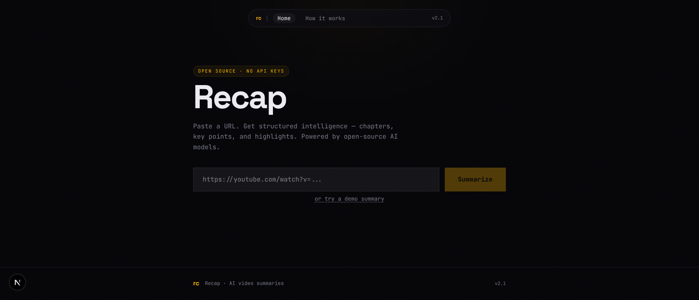

# Recap

> AI-powered YouTube video summaries using open-source models. Runs locally — no API keys, no cloud.

[](https://mahesh-diwan.github.io/recap/)
[](LICENSE)

## What is Recap?

Recap is a local-first YouTube video summarizer. It fetches a video's transcript, processes it through an open-source AI model, and produces a structured summary — all running on your own machine. No cloud services, no API keys, no data leaving your computer.

**Key features:**

- **Structured summaries** — TL;DR, timestamped chapters, key takeaways, and notable quotes
- **Streaming output** — watch the summary appear in real-time via Server-Sent Events
- **Clickable timestamps** — jump to any moment in the video directly from the summary
- **Markdown export** — download the full summary as a linked Markdown file
- **Multi-model support** — works with Qwen, Llama, Gemma, Mistral, and any Ollama-compatible model
- **Demo mode** — try it instantly with a pre-cached summary (no Ollama required)
- **Private** — everything runs locally, your data never leaves your machine

## Demo



Paste a YouTube URL, get a structured summary. Try the [live demo](https://mahesh-diwan.github.io/recap/) to see a pre-cached example.

## Quick Start (No Ollama Required)

You can run Recap and try the demo feature without installing Ollama:

```bash
git clone https://github.com/mahesh-diwan/recap.git
cd recap
npm install
npm run dev
```

Open http://localhost:3000 and click **"try a demo summary"** — a pre-cached summary loads instantly.

## Full Setup with Ollama

To summarize any YouTube video, you need Ollama running locally.

### Step 1: Install Ollama

**macOS / Linux:**

```bash
curl -fsSL https://ollama.com/install.sh | sh
```

**Windows:** Download the installer from https://ollama.com

After installation, verify it's running:

```bash
ollama --version
```

### Step 2: Pull a Model

The default model is small and fast. Pull it with:

```bash
ollama pull qwen2.5:1.5b
```

Other options (larger = better quality, slower on CPU):

| Model          | Size   | Speed (CPU)  | Quality |
| -------------- | ------ | ------------ | ------- |
| `qwen2.5:1.5b` | 1.5 GB | ~15-20 tok/s | Good    |
| `llama3.2:3b`  | 2 GB   | ~10-15 tok/s | Better  |
| `gemma2:2b`    | 1.7 GB | ~12-18 tok/s | Good    |
| `mistral`      | 4 GB   | ~5-8 tok/s   | Best    |

### Step 3: Run Recap

```bash
npm run dev
```

The app auto-detects which models you have installed and picks the best one. Paste any YouTube URL and click **Summarize**.

### Hardware Requirements

| Component | Minimum            | Recommended                |
| --------- | ------------------ | -------------------------- |
| RAM       | 4 GB               | 8 GB+                      |
| CPU       | Any modern x86/ARM | 4+ cores                   |
| Disk      | 2 GB free          | 5 GB+                      |
| GPU       | Not required       | Any (significantly faster) |

Recap works on CPU. A GPU (NVIDIA, AMD, or Apple Silicon) will speed up inference by 3-10x but is not required.

## Configuration

Environment variables (optional — all have sensible defaults):

| Variable          | Default                  | Description                                                                   |
| ----------------- | ------------------------ | ----------------------------------------------------------------------------- |
| `OLLAMA_BASE_URL` | `http://localhost:11434` | Ollama server URL. Change this if Ollama runs on a different machine or port. |
| `OLLAMA_MODEL`    | Auto-detected            | Force a specific model instead of auto-detection.                             |

Set these in `.env.local` or export them in your shell.

## How It Works

1. **Transcript extraction** — You paste a YouTube URL. The app fetches captions (auto-generated or manual) via the `youtube-transcript` package. Timestamps are preserved.

2. **Model resolution** — The app checks which Ollama models are available and picks the best one (preferring `qwen2.5:1.5b` for speed).

3. **Structured summarization** — The transcript is sent to the model with a structured prompt. The model produces JSON with a TL;DR, chapters, key points, and highlights — all with timestamps.

4. **Streaming** — The summary streams to your browser in real-time via Server-Sent Events (SSE). You see it form as the model generates it.

5. **Caching** — Summaries are cached locally in `data/cache.json` so re-visiting a video is instant.

## Export

Click **"Export .md"** after summarizing to download the full summary as a Markdown file with linked timestamps. The export includes the video title, thumbnail, and all summary sections.

## Troubleshooting

**"Ollama not running" error:**
Make sure Ollama is started. Run `ollama serve` in a terminal, or check that the Ollama menu bar icon is active.

**"No Ollama model found":**
Pull a model first: `ollama pull qwen2.5:1.5b`

**Slow summaries:**
The default model runs on CPU. For faster inference:

- Use a smaller model (`qwen2.5:1.5b` is the fastest)
- Use a machine with a GPU
- Set `OLLAMA_NUM_THREADS=4` (or your core count) for optimal CPU usage

**Transcript not found:**
Some videos don't have captions available. Try a different video or one with manual captions.

**Port 3000 already in use:**
Run on a different port: `npx next dev -p 3001`

## Contributing

Contributions are welcome. The project uses:

- **Next.js 15** (App Router) for the web framework
- **Tailwind CSS v4** for styling
- **Vitest** for testing
- **TypeScript** for type safety

To contribute:

```bash
git clone https://github.com/mahesh-diwan/recap.git
cd recap
npm install
npm run dev     # start dev server
npx vitest      # run tests
```

## Credits

- **Demo video:** ["Every Way To Run Open Source AI Models"](https://www.youtube.com/watch?v=vehYE1DfkZg) by [Tina Huang](https://www.youtube.com/@TinaHuang) — used with appreciation for the excellent overview of open-source AI deployment options.
- **Models:** Powered by open-source AI models from [Alibaba (Qwen)](https://qwenlm.github.io/), [Meta (Llama)](https://llama.meta.com/), [Google (Gemma)](https://ai.google.dev/gemma), and [Mistral AI](https://mistral.ai/).
- **Ollama:** [ollama.com](https://ollama.com) — making it easy to run open-source models locally.

## License

This project is licensed under the MIT License — see the [LICENSE](LICENSE) file for details.
