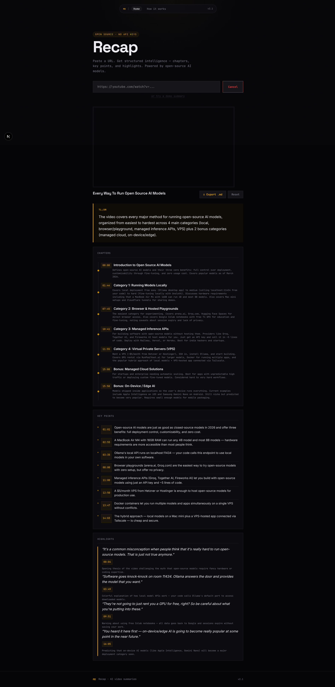

# Recap

> AI-powered YouTube video summaries using open-source models. Runs locally — no API keys, no cloud.

[](https://mahesh-diwan.github.io/recap/)

## Demo


Paste a YouTube URL, get a structured summary with chapters, key points, and highlights. Try the [live demo](https://mahesh-diwan.github.io/recap/) to see a pre-cached example.



## Quick Start (No Ollama Required)

```bash
git clone https://github.com/mahesh-diwan/recap.git
cd recap
npm install
npm run dev
```

Open http://localhost:3000 → click "try a demo summary" → instant result.

## Full Setup with Ollama

### 1. Install Ollama

**macOS / Linux:**

```bash
curl -fsSL https://ollama.com/install.sh | sh
```

**Windows:** Download from https://ollama.com

### 2. Pull a model

```bash
# Recommended (fast, 1.5GB, works well on CPU)
ollama pull qwen2.5:1.5b

# Alternatives
ollama pull llama3.2:3b
ollama pull gemma2:2b
ollama pull mistral
```

### 3. Run Recap

```bash
npm run dev
```

The app auto-detects available models. Paste any YouTube URL and click Summarize.

### Hardware Requirements

| Component | Minimum            | Recommended            |
| --------- | ------------------ | ---------------------- |
| RAM       | 4GB                | 8GB+                   |
| CPU       | Any modern x86/ARM | 4+ cores               |
| Disk      | 2GB free           | 5GB+                   |
| GPU       | Not required       | Any (faster inference) |

The default model (qwen2.5:1.5b) runs comfortably on CPU at ~15-20 tokens/second.

## Configuration

| Variable          | Default                  | Description                                           |
| ----------------- | ------------------------ | ----------------------------------------------------- |
| `OLLAMA_BASE_URL` | `http://localhost:11434` | Ollama server URL (use for remote/distributed setups) |
| `OLLAMA_MODEL`    | Auto-detected            | Override automatic model selection                    |

## How It Works

1. **Transcript extraction** — Fetches YouTube captions via `youtube-transcript`
2. **Model resolution** — Auto-selects best available Ollama model
3. **Structured summarization** — Generates TL;DR, chapters, key points, and highlights
4. **Streaming** — Summary streams to the browser via Server-Sent Events (SSE)

## Project Structure

```
app/
  page.tsx              # Main UI — URL input, streaming summary display
  layout.tsx            # Root layout (fonts, metadata)
  globals.css           # Design tokens, components, animations
  docs/page.tsx         # "How Recap Works" documentation page
  api/
    transcript/route.ts # YouTube transcript extraction
    summarize/route.ts  # Ollama inference + SSE streaming
    demo/route.ts       # Pre-cached demo summary
lib/
  inference.ts          # Deep module — model resolution, Ollama API calls, streaming
  prompts.ts            # SummaryJSON type definition, prompt building, chunking
  youtube.ts            # Video ID extraction from URLs
  markdown.ts           # Summary to Markdown conversion (for export)
  cache.ts              # JSON file caching layer
data/
  demo-cache.json       # Pre-cached demo summary
docs/
  index.html            # Static GitHub Pages demo
```

## Tech Stack

- **Framework:** Next.js 15 (App Router)
- **Styling:** Tailwind CSS v4 + custom CSS variables
- **Inference:** Ollama (local, open-source)
- **Transcript:** youtube-transcript (npm)
- **Animations:** Motion v12
- **Testing:** Vitest

## Export

Click "Export .md" after summarizing to download the summary as a Markdown file with linked timestamps.

## Credits

- **Demo video:** ["Every Way To Run Open Source AI Models"](https://www.youtube.com/watch?v=vehYE1DfkZg) by [Tina Huang](https://www.youtube.com/@TinaHuang) — used with appreciation for the excellent overview of open-source AI deployment options.
- **Models:** Powered by open-source AI models from [Alibaba (Qwen)](https://qwenlm.github.io/), [Meta (Llama)](https://llama.meta.com/), [Google (Gemma)](https://ai.google.dev/gemma), and [Mistral AI](https://mistral.ai/).
- **Ollama:** [ollama.com](https://ollama.com) — running open-source models locally.

## License

MIT License. Use freely, modify freely, ship freely.

```
MIT License

Copyright (c) 2026

Permission is hereby granted, free of charge, to any person obtaining a copy
of this software and associated documentation files (the "Software"), to deal
in the Software without restriction, including without limitation the rights
to use, copy, modify, merge, publish, distribute, sublicense, and/or sell
copies of the Software, and to permit persons to whom the Software is
furnished to do so, subject to the following conditions:

The above copyright notice and this permission notice shall be included in all
copies or substantial portions of the Software.

THE SOFTWARE IS PROVIDED "AS IS", WITHOUT WARRANTY OF ANY KIND, EXPRESS OR
IMPLIED, INCLUDING BUT NOT LIMITED TO THE WARRANTIES OF MERCHANTABILITY,
FITNESS FOR A PARTICULAR PURPOSE AND NONINFRINGEMENT. IN NO EVENT SHALL THE
AUTHORS OR COPYRIGHT HOLDERS BE LIABLE FOR ANY CLAIM, DAMAGES OR OTHER
LIABILITY, WHETHER IN AN ACTION OF CONTRACT, TORT OR OTHERWISE, ARISING FROM,
OUT OF OR IN CONNECTION WITH THE SOFTWARE OR THE USE OR OTHER DEALINGS IN THE
SOFTWARE.
```
